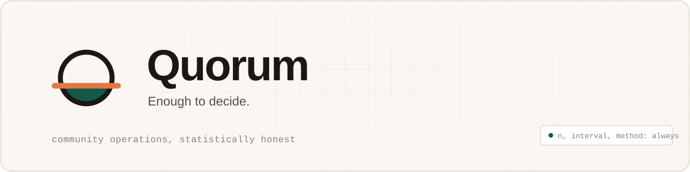
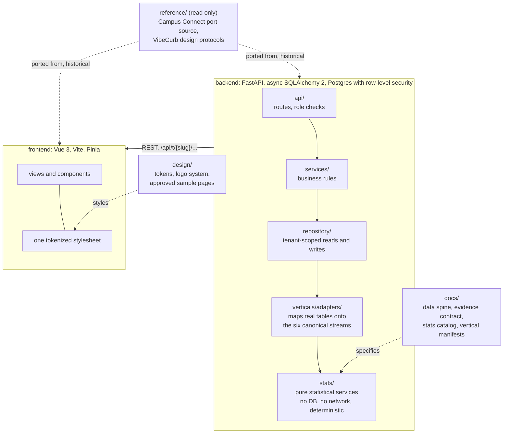

<p align="center">
  
</p>

<p align="center">
  <strong>The LLM narrates. Statistics decide.</strong>
</p>

---

Quorum is a multi-tenant community operations platform. A housing society, a campus club, an NGO,
an alumni chapter, a co-op, a sports club, a professional guild: each onboards by slug, picks a
vertical, and gets the operations software every community needs (requests, dues, events,
announcements, polls) plus a real statistical engine underneath it, not a dashboard of averages
and not an AI wrapper that guesses.

Every figure that reaches a screen carries its sample size, its interval, its method, and whether
its assumptions held. A number without that envelope does not render. An AI assistant may explain
a figure. It may not compute one.

## Why this exists

Community software already has issue trackers, dues ledgers and poll tools. What none of them
have is honesty about uncertainty. An average resolution time computed by dropping open tickets is
biased downward, and every dashboard in the category does exactly that. A vendor that resolved
three jobs out of three is not better than one that resolved forty-seven out of fifty-two, and
every leaderboard in the category ranks them as if it were. A point estimate for "when will this
be fixed" is a guess wearing a number.

Quorum's answer is a set of methods borrowed from survival analysis, statistical process control,
queueing theory, empirical Bayes, calibrated forecasting, conformal prediction and social choice
theory, applied to six canonical data streams that every vertical maps onto. The stream contract is
written once. The mathematics is written once. What changes per community is a manifest, not code.

## The six streams

| Stream | Carries | Feeds |
|---|---|---|
| `request_flow` | Anything that opens, gets assigned and closes | survival curves, control charts, queueing, conformal ETA |
| `ledger` | Signed money movements with a category and a counterparty | forecasting, runway simulation, drift detection |
| `member_lifecycle` | Join, activate, lapse, exit | retention, churn risk |
| `participation` | Attendance, RSVPs, volunteer hours, the nudge exposure log | segmentation, network structure, experiments |
| `signal` | Free text and ordinal ratings | topic mining, near-duplicate detection |
| `decision` | Polls, ballots, budget allocations | social choice, participatory budgeting, representativeness |

Full field-level schema and the ten normative censoring rules for `request_flow` are in
[`docs/DATA_SPINE.md`](docs/DATA_SPINE.md).

## The evidence contract

```python
Evidence(
    value=8.0,
    n=187,
    n_censored=44,
    interval=(3.4, 5.6),
    interval_kind="greenwood-95",
    method="survival.median_resolution_days",
    checks=(Check(id="censoring-informative", status="WARN", ...),),
    insufficient_data=False,
)
```

Four render states follow from this, and every component in the frontend handles all four: a
clean estimate, a qualified estimate with a visible caveat, a value withheld because a blocking
check failed, and a calm, deliberate not-enough-data state that never reads as an error. Full spec
in [`docs/EVIDENCE_CONTRACT.md`](docs/EVIDENCE_CONTRACT.md).

## Architecture



Every table carries `tenant_id`, every repository read goes through a tenant-scoped base class,
and Postgres row-level security backs that as defense in depth. The slug in the URL must match the
tenant claim in the JWT.

`backend/app/stats/` is pure by rule, not by convention. A test walks every module under it and
fails the build if it imports the database layer, the network stack, or the system clock. Services
fetch. Statistics compute. The two never mix.

## Running it

Fastest path, with two demo tenants already seeded and a real statistical worker running:

```bash
docker compose up
```

Then open `http://localhost:5173` and sign in with one of the seeded demo accounts below.

**Demo logins.** Password for every seeded account, admin and member alike, is **`Demo12345!`**.

| Tenant | Vertical | Admin login | Sample member login |
|---|---|---|---|
| Vaikunth Heights | housing society | `admin@vaikunth-heights.demo` | `resident1@vaikunth-heights.demo` |
| Aavartan Robotics | campus club | `admin@aavartan-robotics.demo` | `member1@aavartan-robotics.demo` |

Member logins run `resident1@...` through `resident60@...` for Vaikunth Heights and `member1@...`
through `member90@...` for Aavartan Robotics. Every account uses the same `Demo12345!` password.
Full details, what each tenant contains, and the manual (no Docker) path are in
[`docs/RUNNING_LOCALLY.md`](docs/RUNNING_LOCALLY.md).

### Manual setup, no Docker

```bash
cd backend
uv sync
cp .env.example .env   # then fill in the values, see docs/RUNNING_LOCALLY.md
uv run alembic upgrade head
uv run python scripts/seed_demo.py   # loads the two demo tenants above
uv run uvicorn main:app --reload
```

```bash
cd frontend
cp .env.example .env   # VITE_API_BASE_URL, see .env.example for the default
npm install
npm run dev
```

Open `http://localhost:5173` and sign in with a demo login from the table above.

### Running the tests

```bash
cd backend && uv run pytest
cd frontend && npm run test
```

Secrets are never committed. `.env.example` in both `backend/` and `frontend/` is the contract for
every variable a real deploy needs.

## Statistical correctness, checked against known answers

Every statistical service is tested against something external, not against its own prior output.
Kaplan-Meier and Cox proportional hazards reproduce published coefficients on the standard `lung`
and `rossi` datasets. Erlang-C staffing matches published tables. A forecaster that cannot beat a
seasonal-naive baseline on rolling-origin cross-validation does not ship. A conformal interval's
empirical coverage is checked against its nominal rate over thousands of trials, not eyeballed. A
regression test asserts directly that naive mean-of-closed-tickets and Kaplan-Meier diverge, and
that the platform reports the Kaplan-Meier figure.

Full method-by-method detail, including which services have no external ground truth and are
tested against synthetic recovery or a theorem instead, in
[`docs/STATS_CATALOG.md`](docs/STATS_CATALOG.md).

## Documentation

| File | What it covers |
|---|---|
| [`PLAN.md`](PLAN.md) | What this is and why, in full |
| [`CONTEXT.md`](CONTEXT.md) | Current build state and the decision log |
| [`docs/WORKPLAN.md`](docs/WORKPLAN.md) | The task board |
| [`docs/RULES.md`](docs/RULES.md) | Engineering policy and test gates |
| [`docs/GLOSSARY.md`](docs/GLOSSARY.md) | Domain and statistical vocabulary |
| [`docs/DATA_SPINE.md`](docs/DATA_SPINE.md) | The six streams, field by field |
| [`docs/STATS_CATALOG.md`](docs/STATS_CATALOG.md) | Every statistical service, its assumptions, its known answer |
| [`docs/EVIDENCE_CONTRACT.md`](docs/EVIDENCE_CONTRACT.md) | The envelope every statistic travels in |
| [`docs/VERTICALS.md`](docs/VERTICALS.md) | The seven community types Quorum ships with |
| [`docs/STATS_API.md`](docs/STATS_API.md) | The read surface and the agent tool signatures |
| [`docs/RUNNING_LOCALLY.md`](docs/RUNNING_LOCALLY.md) | Docker and manual local setup, with demo data |
| [`design/BRAND.md`](design/BRAND.md) | Identity, palette, type, motion |

## Design

Warm limestone, spruce, apricot. Bricolage Grotesque for display, Inter Tight for body text,
JetBrains Mono for every number a statistic produces, so a figure that came out of an evidence
envelope always reads in a different face from prose. The logo is a circle with a horizontal chord
that overshoots both edges, the area below the chord filled: a level risen to meet a rule.

Full token set in [`design/tokens.css`](design/tokens.css), logo system and usage rules in
[`design/brand/logo/`](design/brand/logo/), the approved reference pages in
[`design/samples/quorum/`](design/samples/quorum/).

## License

Not yet decided.
