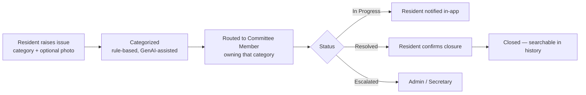
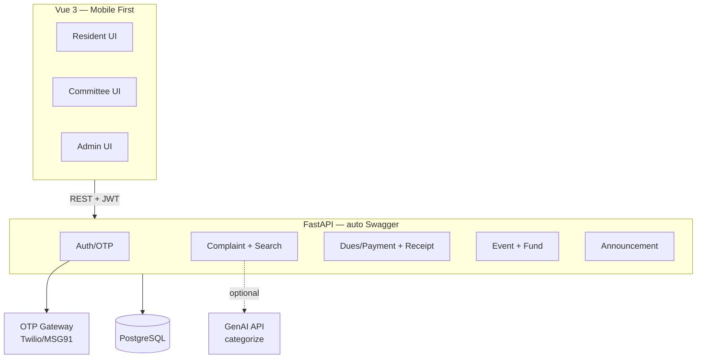
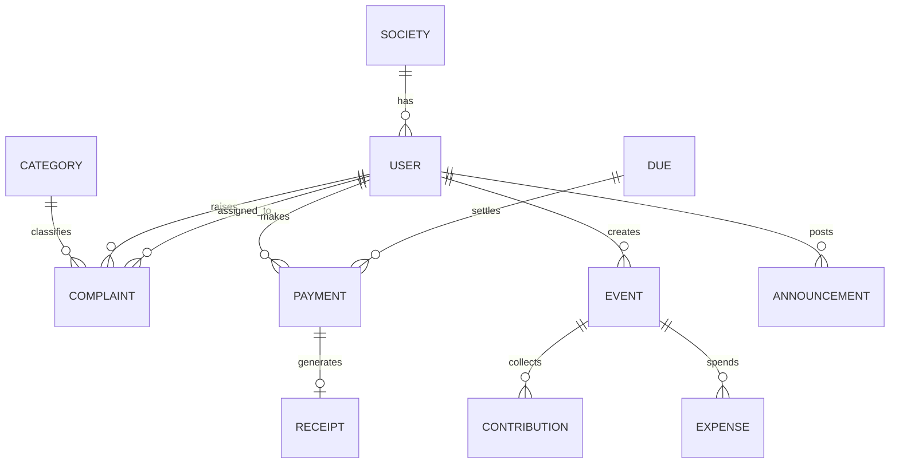
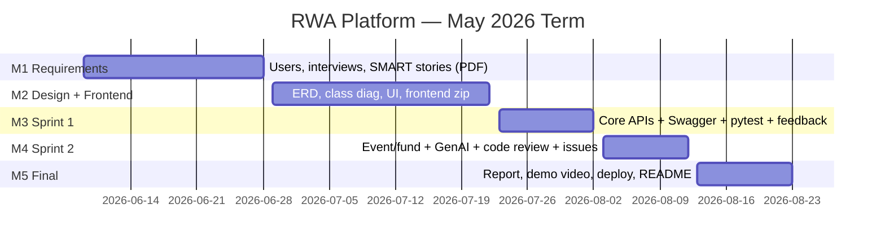

# RWA Community Platform — Focused Project Plan (v2, Narrowed)

**Course**: IITM BS Software Engineering, May 2026 term · **Problem Statement**: Option 1 — Community Services Platform (Apartment / RWA subdomain) · **Team**: Team-001 (5 members)

**What changed in v2**: Scope cut to a single spine + 2 supporting workflows after instructor feedback ("too broad, too many users/features, check feasibility"). Every feature below is either *one entity + a status flow* or a single contained API call — no hidden subsystems.

---

## 1. Problem Statement (one line)

> A **mobile-first platform where residents raise and track society issues and maintenance dues, and committee members resolve and verify them** — replacing scattered WhatsApp screenshots and paper registers with one auditable trail.

**Context (2 lines)**: Urban medium/large societies run on WhatsApp groups + physical registers + manual cash handling. Two interviews (committee member, ex-Secretary) validated three concrete pains: no complaint ownership/tracking, manual error-prone payment verification, and no transparent event-fund reporting.

---

## 2. The Spine (everything hangs off this)

**Spine = the Issue/Request lifecycle.** Dues and Events are the two supporting workflows; auth + member directory are cross-cutting.

**Why this is the spine**: it's the one feature the instructor explicitly approved, it's a clean state machine, and the other two workflows reuse the same ticket+status pattern.

---

## 3. User Identification & Roles

### 3a. User tiers (for M1 deliverable)

| Tier | User | Why |
|---|---|---|
| Primary | **Resident** | Largest base — raises issues, pays dues, views events |
| Primary | **Committee Member** | Owns an issue category; resolves, verifies payments, runs events |
| Secondary | **Secretary / Admin** | Super-admin: members, categories, oversight |
| Tertiary | New Resident / Tenant | Onboarding only (register → approval) |
| Tertiary | External Auditor | Occasional read-only fund view |

### 3b. System roles actually implemented = **3** (tertiary users map onto these)

| Role | Key Permissions | Notes |
|---|---|---|
| **Resident** | Raise/track/close own issues, view & pay dues, view events & funds, upvote announcements | Default role on registration |
| **Committee Member** | Manage issues in assigned category, post announcements, create events, log expenses; *(finance flag)* verify payments + issue receipts | Treasurer = Committee Member with `is_finance=true` |
| **Admin (Secretary)** | All-issue escalation view, configure categories, assign committee members, manage member directory | Super-admin |

> **Cut from earlier plan**: President (merged into Admin), Treasurer (a Committee flag, not a role), Group Leader, Guest, and all external roles (Expert, Vendor, Govt) from the old User-Stories draft. **That old broad draft is retired.**

---

## 4. Final Feature Set (locked)

| # | Feature | Workflow | Build cost | Milestone |
|---|---|---|---|---|
| **MUST-HAVE** ||||
| 1 | Phone + OTP auth, JWT, role-based access | Cross-cutting | Low | M2→S1 |
| 2 | Mobile-first responsive UI (Vue 3) | Cross-cutting | Low | M2 |
| 3 | Member directory (search/filter, approve, activate) | Cross-cutting | Low | S1 |
| 4 | **Issue/complaint ticketing** (raise → route → status → close) | **Spine** | Low | S1 |
| 5 | Resolved-issue history + search (dedupe before raising) | Spine | Low (reuses Complaint entity) | S1 |
| 6 | Announcement board + upvote | Spine | Low | S1 |
| 7 | Maintenance dues + mark-paid + treasurer verify + **auto digital receipt** | Payments | Low (mock, no gateway) | S1 |
| 8 | Event creation + contributions/expenses + **auto fund summary** (collected/spent/balance) | Events | Low | S2 |
| **SHOULD-HAVE (contained, single API call)** ||||
| 9 | GenAI complaint auto-categorization (1 LLM call + keyword fallback) | Spine | Low | S2 |
| **DEFERRED — "Future Work" slide only (zero scope risk)** ||||
| — | WhatsApp one-way broadcast | — | Medium (Meta approval) | Stretch, sandbox fallback |
| — | OCR / document verification | — | Vague → **cut** | Future |
| — | Cross-society knowledge network, vendor marketplace, expert portal, voting/elections, inventory/asset ledger | — | Separate products | **Cut** |

**Scope guard**: the "knowledge repository" is now just **search over resolved complaints** within the one society — same entity, no new backend, no scary multi-tenant framing.

---

## 5. User Stories (SMART)

| # | Role | As a / I want / So that | Pain | Sprint |
|---|---|---|---|---|
| 1 | Resident | …I want to raise a complaint with a category and photo and track its status, so that I know it's being handled | No tracking | S1 |
| 2 | Resident | …confirm resolution to close it (or reopen if unfixed), so that closure reflects reality | No ownership | S1 |
| 3 | Resident | …search resolved issues before raising a new one, so that I don't duplicate a known fix | Repeated issues | S1 |
| 4 | Resident | …upvote announcements/issues, so that committee sees what residents prioritize | No signal | S1 |
| 5 | Committee | …see issues assigned to my category and update status with a note, so that accountability is clear | Unclear routing | S1 |
| 6 | Committee | …escalate a blocked issue to Admin, so that nothing stalls silently | Falls to President | S1 |
| 7 | Admin | …configure categories and assign each to a committee member, so that every issue auto-routes to an owner | No routing | S1 |
| 8 | Admin | …view all unresolved issues across categories, so that nothing is dropped | No oversight | S1 |
| 9 | Admin/Treasurer | …create a maintenance due for a period for residents, so that everyone sees what's owed | Manual tracking | S1 |
| 10 | Resident | …view my dues and full payment history, so that I don't rely on WhatsApp screenshots | Screenshot chaos | S1 |
| 11 | Resident | …mark a due as paid with a reference/screenshot, so that the treasurer can verify it | Manual verify | S1 |
| 12 | Treasurer | …verify a payment and auto-generate a digital receipt, so that reconciliation errors are eliminated | Cash/entry errors | S1 |
| 13 | Resident | …download my digital receipt, so that I have proof without an in-person step | Receipts not collected | S1 |
| 14 | Committee | …create an event with a budget and publish it to all, so that I announce once, not across channels | Duplicate posting | S2 |
| 15 | Committee | …log contributions and expenses against an event, so that the fund summary is real-time | Manual post-event report | S2 |
| 16 | Resident | …view a transparent collected/spent/balance summary per event, so that I trust how money is used | No transparency | S2 |
| 17 | New user | …register with phone + OTP and await admin approval, so that only verified residents get access | Low app comfort | S1 |
| 18 | Admin | …manage the member directory (search, approve, deactivate), so that access stays correct | Paper registers | S1 |

**3 fully-expanded SMART exemplars** (replicate this pattern for all 18 in the M1 PDF, each with 3+ acceptance criteria):

> **US-1 (Resident, raise complaint)** — **S**: raise a categorized complaint with optional photo. **M**: status visible within 1s of any update; 100% of complaints have an owner on creation. **A**: standard CRUD + state machine. **R**: solves the #1 validated pain (no tracking). **T**: routing to a committee member happens automatically at submission.

> **US-12 (Treasurer, verify payment)** — **S**: verify a resident-submitted payment and emit a receipt. **M**: every verified payment generates exactly one immutable receipt; verification logged with timestamp + verifier. **A**: status flip + receipt record (no real gateway). **R**: eliminates cash-handoff reconciliation errors. **T**: receipt available to resident immediately on verification.

> **US-16 (Resident, fund transparency)** — **S**: view per-event collected/spent/balance. **M**: summary recomputes on every contribution/expense; balance = collected − spent always. **A**: aggregate query. **R**: builds trust in community money. **T**: figures update in real time, not post-event.

---

## 6. Tech Stack (locked — decoupled, per course requirement)

| Layer | Choice | Why |
|---|---|---|
| Frontend | **Vue 3 CLI + Vue Router + vanilla CSS** (mobile-first, 375px base) | Decoupled SPA; full styling control |
| Backend | **FastAPI** | Auto-generates Swagger/OpenAPI → *directly produces the Sprint YAML deliverable* |
| Database | **PostgreSQL** | Relational fit for the ERD below |
| Auth | **Phone + OTP** (Twilio / MSG91 free tier) + **JWT** | Residents already trust OTP (UPI/banking); no passwords |
| GenAI | **Gemini / OpenAI API** — single call: complaint text → category, with keyword fallback | "Latest tech" angle, contained, fails safe |
| Testing | **pytest** | Sprint deliverable |
| PM / VCS | **Trello** + **GitHub** (Issues + PR reviews = M4 evidence) | Beginner-friendly; free |
| Deploy | **Vercel** (FE) + **Railway/Render** (BE) | Free tiers |
| Secrets | `.env` (never committed) | Course requirement |

---

## 7. Architecture & Data Model

### 7a. System architecture

### 7b. ERD (narrowed — 9 entities)

*Dropped vs old ERD: DOCUMENT and KNOWLEDGE_ENTRY (a resolved COMPLAINT **is** the knowledge — just query `status=closed`).*

---

## 8. How to Build It Efficiently (the "most efficient way")

| Tactic | Saves |
|---|---|
| **One generic ticket + status-enum pattern** reused for Complaint, Payment, Event → write the state machine once | ~2 modules of work |
| **FastAPI auto-Swagger** — YAML deliverable is generated, not hand-written | Whole Sprint YAML task |
| **Mock payments = a status field** (`pending → verified`); no gateway, no real money | Eliminates payment-integration risk |
| **Receipt via `reportlab`** — one template function, populated from PAYMENT row | A "document subsystem" |
| **GenAI categorize = one function** with a hard-coded keyword fallback → never blocks the flow | De-risks the only external-AI piece |
| **Frontend = list + detail + card**, reused across complaints/events/announcements | ~half the page work |
| **Resolved-issue search = a filtered query** on COMPLAINT, not a new repository | A whole module |

**UI pages (8 — covers M2 "most pages"):** Login/OTP · Resident Home · Raise Complaint · Complaint List+Detail (cards, upvote) · Dues & Payments · Events & Fund Summary · Announcements · Committee/Admin Dashboard.

---

## 9. Timeline (official May 2026 milestone dates)

| Milestone | Due | Deliverable | Submission artifact |
|---|---|---|---|
| **M1** | **Jun 28** | User identification, interview audio/video proof, 18 SMART stories | PDF |
| **M2** | **Jul 22** | Schedule, ERD, class diagram, scrum minutes, Trello/Gantt/Kanban screenshots, UI screenshots, frontend zip + README | PDF + `team-001-milestone-1-2.zip` |
| **M3 (Sprint 1)** | **Aug 2** | Swagger YAML, API code (auth/complaints/members/dues), 20–30 test cases, pytest output, user feedback | PDF |
| **M4 (Sprint 2)** | **Aug 12** | Event/fund + announcement + GenAI APIs, updated YAML/tests, **GitHub Issues + PR-review evidence** | PDF |
| **M5 Final** | **Aug 23** | Final report, demo video, deployed app, README, issue-tracker evidence | `team-001-milestone-3-5.zip` |

*Note: the general course FAQ describes six Waterfall milestones; the May 2026 term consolidates these into the five dated submissions above plus the final showcase (15 min: 10 present + 5 Q&A). **Peer review is mandatory after M3 and the final** — skipping it forfeits that component.*

---

## 10. Team & Role Assignment

| Member | GitHub | Role | Owns |
|---|---|---|---|
| Atharv Khare | @1mystic | **Lead PM + Frontend** | Domain, user research, auth/complaint/committee UI |
| Kavisha Tankle | @kavstea | **Scrum Master** | Trello, standups, minutes, Gantt/Kanban screenshots |
| Shrestha Srivastava | @Srivastava-Shrestha | **Backend + Code Reviewer** | Auth + Dues/Payment + Receipt APIs; **approves all PRs** |
| Pawan Kumar Choudhary | @22f3000162 | **Backend** | Complaint + Event/Fund + Announcement + GenAI categorize APIs |
| Shrishti Gupta | @23f2004336 | **Frontend** | Dues, events, announcements, admin/member-directory UI |

**Working rhythm**: daily 15-min standup (Kavisha) · Trello flow Backlog→Sprint→In Progress→In Review→Done · every PR needs Shrestha's approval before merge · weekly TA-as-client meeting · no isolated scope changes.

---

## 11. Explicit Scope Guards (paste into the TA discussion)

| Decision | Rationale |
|---|---|
| Cut OCR / document verification | Instructor flagged as unclear; "verify legal docs" is undefined — replaced by plain image attachment on a payment/complaint |
| Cut cross-society knowledge network | Multi-tenant — a different product; reframed as single-society resolved-issue search |
| Cut vendor marketplace / expert portal / voting / inventory ledger | Each is a hidden subsystem; out of a 3-month MVP |
| Defer WhatsApp broadcast to stretch | Meta-approval timeline is outside our control; sandbox fallback only |
| 3 system roles, not 6 | Fewer roles = clearer feasibility; tertiary users map onto the 3 |
| GenAI limited to 1 categorization call | Modern-tech signal without external-AI risk; keyword fallback always works |

---

## 12. Compliance Check (course requirements → our plan)

| Requirement | Met by |
|---|---|
| ≥2 distinct roles | 3 roles (Resident, Committee, Admin) |
| Multiple interrelated workflows | Issues (jobs/requests + assignment) + Dues (payments/invoices) + Events (communication + funds) |
| Well-defined APIs | FastAPI + auto Swagger YAML |
| Automated tests for critical logic | pytest on state machines (complaint status, payment verify, fund balance) |
| Designed for future growth | Deferred features named as Future Work; entities extensible |
| Decoupled architecture | Vue 3 SPA ↔ FastAPI REST |
| Secrets handling | `.env`, never committed |
