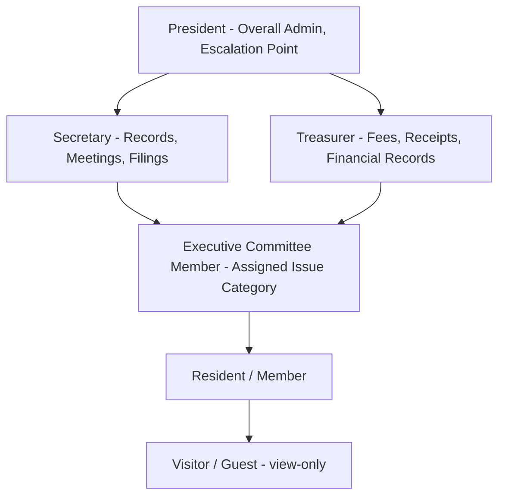
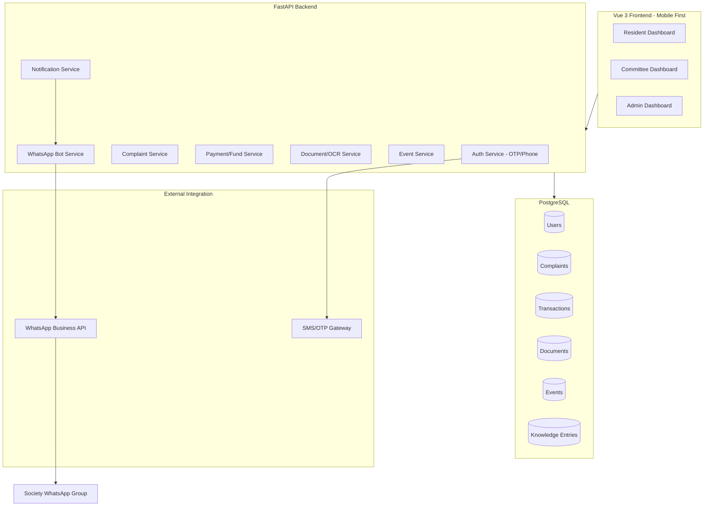
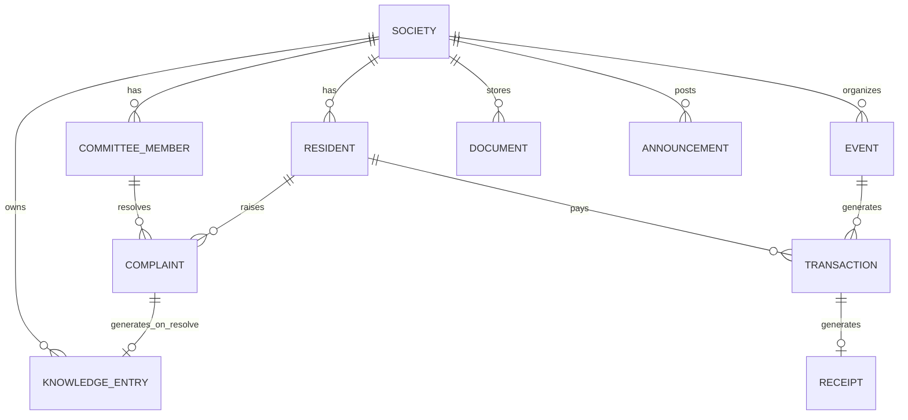
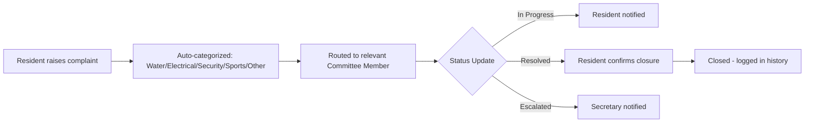
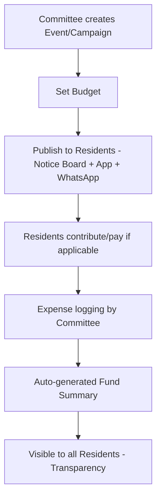
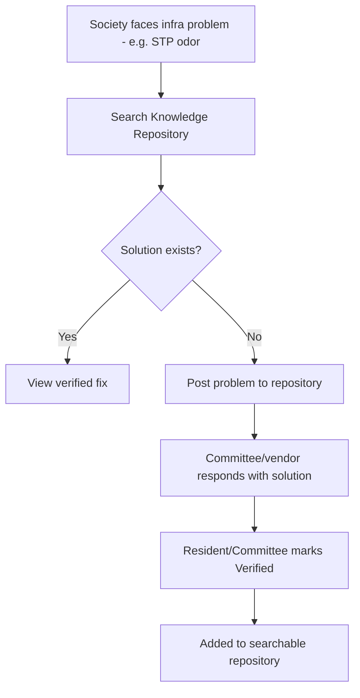
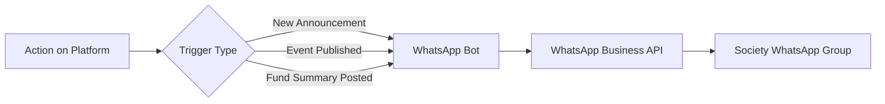
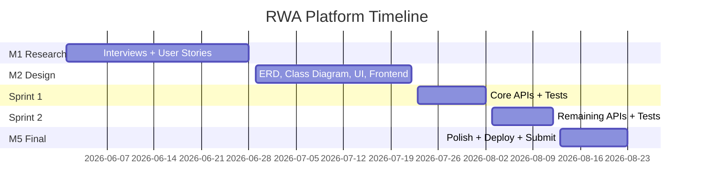

# RWA Community Platform - Master Context Document

**Purpose**: Single source of truth for this project. Contains problem statement, research, interviews, user stories, architecture, team plan, and decisions made across all discussions to date.

**Last Updated**: Jun 2026 (M1 phase, in progress)

---

## 1. Project Identity

| Field | Value |
|---|---|
| Course | IITM BS Software Engineering, May 2026 term |
| Official Problem Statement Selected | Option 1: Community Services Platform |
| Subdomain | Apartment Association / RWA (Resident Welfare Association) |
| Project Name | RWA Community Platform |
| Team | Team-001 (5 members, see Section 11) |

---

## 2. Problem Statement Evolution (Decision History)

The team considered and rejected two earlier ideas before locking RWA as final scope. Documented for context/transparency, not for re-litigation:

1. **Civic Services Platform** (complaints to government authorities) — rejected: government departments shown to resist digital adoption, lower interview access
2. **Guided Community Setup Platform** (volunteer orgs + community templates, broader scope) — rejected: too broad, risked merging two different products (campus clubs + societies); also considered merging with a "Campus Connect" concept from another team member's draft — rejected as scope creep, different user base entirely
3. **RWA/Society Platform** (current, FINAL) — locked in after two real interviews validated strong, specific pain points

**Decision rule applied**: Lock scope once real interview evidence validates pain points. No further pivots after this point.

---

## 3. Target Users

**Profile**: Urban, medium-to-large residential societies. Middle to upper-middle class. Existing (if informal) committee structure already in place — not greenfield communities needing structure from scratch.

### User Tiers

| Tier | User | Rationale |
|---|---|---|
| Primary | Society Secretary | Owns daily operations, highest pain exposure |
| Primary | Resident/Member | Largest user base — complaints, payments, events |
| Secondary | Committee Member (Treasurer, Event Manager, Executive Member) | Handles specific issue categories |
| Secondary | Local Group Leader (e.g., women's discussion group) | Sub-community coordination, visibility needs |
| Tertiary | New Resident/Tenant | Onboarding-only user |
| Tertiary | Society Auditor/External Accountant | Occasional fund-record viewer |

### Confirmed Office Bearer Structure (from interview)

| Role | Permissions | Confirmed By Interview? |
|---|---|---|
| President (Super Admin) | Final escalation point for all issues, approves major decisions | Yes |
| Secretary (Admin) | Records, minutes, document filings, registration data, announcements | Yes |
| Treasurer (Finance Admin) | Dues, payment verification, digital receipts, fund tracking, event budgets | Yes |
| Executive Committee Member | Manages assigned issue category (water/electrical/security/STP/etc.) | Yes (implied) |
| Resident | Raises complaints, pays dues, books resources, views documents, searches knowledge base | Yes |
| Guest/Visitor | View public announcements only | Not directly confirmed, low priority |

---

## 4. Interviews Conducted

### Interview 1: Society Committee Member (informal discussion)

**Key findings**:
- Social/political friction within committees — members sometimes prioritize appearing "smart"/right over collaborative problem-solving (governance/soft issue, not directly software-solvable; informs UX tone — favor transparent logs over blame-prone workflows)
- **Sewage Treatment Plant (STP) problem**: Society has in-house, builder-installed STP recycling ~80% of water. Remaining 20% is waste/sludge requiring manual disposal. Treated water needs chemical dosing to remove odor.
- **Cost**: ~6 lakhs INR/year combined maintenance cost for STP, funded by residents
- **Vendor gap**: Local STP maintenance vendors (common issue across Bengaluru) lack expertise to upgrade/optimize plants — a knowledge gap at the vendor level, not just resident level
- **Resulting idea (from interviewee directly)**: A central knowledge repository of common society infrastructure problems (STP, lifts, water, electrical) across Indian cities, searchable, with verified peer-contributed solutions

### Interview 2: Ex-Secretary (formal, structured interview — full transcript on file)

**Key findings**:
- RWA = resident-formed NGO managing civic services, security, dispute resolution, festival/event coordination
- **Formation process**: Registration form (house no., owner name, father's name, purchase date, family member count) → General Meeting (notified via WhatsApp + notices + notice board) → Elections
- **Office bearer roles** confirmed exactly as modeled in Section 3
- **Payment flow (current state)**: Resident pays via bank transfer → shares screenshot in WhatsApp group → Treasurer manually verifies → enters into physical register → issues signed receipt (often collected in person via security guard)
- **Receipt adoption gap**: Many residents don't even collect physical receipts — they treat digital proof (the WhatsApp screenshot) as sufficient already. This directly validates a digital-first receipt approach.
- **Event funding model**: Regular events are society-funded. Large festivals (Ganesh Utsav, Durga Puja) — committee members personally visit households for voluntary contributions; UPI/digital contribution also used in parallel, but personal visits remain common.
- **Post-event reporting**: Manual financial report (collected/spent/balance) prepared after each event, posted on notice board + WhatsApp. Reactive, not real-time.
- **Reconciliation issue**: Cash handed person-to-person (not deposited directly) causes entry errors requiring manual follow-up.
- **Critical adoption insight**: Ex-Secretary stated directly that a dedicated app may be hard for less tech-familiar residents, but **~99% of residents actively use WhatsApp** for raising issues (water, electricity, sanitation, waste). This is the strongest single piece of evidence in favor of WhatsApp bot integration as a bridge channel, not a nice-to-have.

**Note**: Only one full Secretary-side transcript is on file as of this document's creation. If a second, separate ex-Secretary interview is conducted later, it should be appended to this section.

---

## 5. Consolidated Problem List (15 items, source-tagged)

| # | Problem | Source | Maps To Feature |
|---|---|---|---|
| 1 | Bills/payments via WhatsApp screenshots, manual verification | Both interviews | Digital invoicing + payment tracking with audit trail |
| 2 | Resident data in physical registers | Both (registration form is paper) | Digital member directory |
| 3 | No central complaint tracking | Interview 1 | Issue/complaint ticketing |
| 4 | No clear issue ownership/routing (falls to President/Secretary) | Both ("President handles any issue") | Role-based task assignment |
| 5 | Manual fund calculation for events | Both (post-event manual report) | Event fund tracking, auto-generated reports |
| 6 | No central achievement showcase | Interview 1 | Announcements module |
| 7 | No document management (registers, minutes, filings) | Both (physical minute register) | OCR document scan & upload |
| 8 | No fund allocation tracking | Both (manual reconciliation errors) | Budget & expense ledger with reconciliation log |
| 9 | No event/campaign structure | Interview 1 | Event & campaign creation |
| 10 | Residents rely on WhatsApp as primary channel | Both, strongly confirmed (~99% usage) | WhatsApp bot auto-broadcast |
| 11 | Low comfort with new apps among some residents | Interview 2, direct quote | Phone+OTP auth, mobile-first, minimal-input design |
| 12 | Sewage Treatment Plant (STP) / infrastructure maintenance knowledge gap | Interview 1 | Central knowledge repository |
| 13 | Vendor competency gap for technical infrastructure (STP, lifts, etc.) | Interview 1 | Knowledge repository with verified fixes |
| 14 | Cash handed person-to-person causing reconciliation errors | Interview 2 | Mandatory digital payment trail |
| 15 | Receipts often not collected even when issued | Interview 2 | Auto-generated digital receipt (no physical step) |

---

## 6. User Stories (SMART Format — Draft Examples, Pre-M1-Finalization)

| User Story | Pain Point Addressed | Feasibility Note |
|---|---|---|
| As a Treasurer, I want to verify and record resident payments digitally, so that reconciliation errors from cash handoffs are eliminated. | #1, #14 | Low risk — core CRUD + audit trail |
| As a Resident, I want to raise a complaint and track its status in real time, so that I know it is being addressed. | #3, #4 | Low risk — CRUD + state machine |
| As a Secretary, I want to upload and OCR-scan documents, so that records are searchable digitally. | #7 | Medium risk — external OCR API dependency (Google Vision/Tesseract), time-box for Sprint 2 |
| As a Committee Member, I want resolved complaints to auto-populate a searchable knowledge base, so recurring issues (e.g., STP problems) aren't solved from scratch each time. | #12, #13 | Low risk for single-society MVP (reuses Complaint entity); cross-society version is Phase 3/stretch only |
| As a Resident, I want to receive society updates via WhatsApp without opening the app, so adoption isn't blocked by app-reluctance. | #10, #11 | Medium risk — depends on WhatsApp Business API (Meta) approval timeline; fallback = Twilio WhatsApp sandbox for demo |
| As a President, I want a single escalation view of all unresolved issues across categories, so nothing is dropped. | #4 | Low risk — aggregation/dashboard query |
| As a Resident, I want to view and pay maintenance dues digitally, so I have a clear payment history without relying on WhatsApp. | #1, #15 | Low risk |
| As a Committee Member, I want to publish event announcements in one place visible to all residents, so I don't repeat the same announcement across channels. | #5, #6 | Low risk |
| As a Resident, I want to view a transparent summary of event funds collected and spent, so I trust how community money is used. | #5, #8 | Low risk |

**Note**: Final M1 deliverable requires 20-25 SMART stories total — above are representative/validated examples; remaining stories to be completed during M1 execution (Jun 19-24 per team plan) covering all 15 problems comprehensively, each with 3+ acceptance criteria.

---

## 7. Interview Questions Bank (For Remaining M1 Interviews)

**Rule applied throughout**: Never ask "would you like an app for X." Only ask what happened, how they handled it, how it felt. Let pain points surface naturally.

### For Society Secretary
- Walk me through your typical week managing the society — what takes most of your time?
- Tell me about the last time a resident complained about something. What happened after they told you?
- How do you currently track who owes maintenance dues and who has paid?
- When was the last time you couldn't find an important document quickly? What did you do?
- If you had to step down tomorrow, how would the next secretary learn what you know?
- Tell me about organizing the last big event — what was the most stressful part?

### For Committee/Event Manager
- How do you find out you've been assigned a task or issue to handle?
- Tell me about a time something fell through the cracks because no one was clearly responsible.
- How do you currently track money spent versus budgeted for an event?
- Walk me through how residents find out about an upcoming event.

### For Local Group Leader (e.g., women's group)
- How do you currently let other residents know what your group is doing or has achieved?
- Tell me about a time you wanted to reach the whole society but it was difficult.
- How do you coordinate with the main committee when you need something (space, funds, approval)?

### For General Residents
- Tell me about the last issue you faced in the society — water, parking, noise, anything. What did you do about it?
- How do you usually find out what's happening in the society — events, notices, decisions?
- Have you ever needed an old document (bill, NOC, receipt) from the society? How did you get it?
- Tell me about paying your last maintenance bill — what was that process like?
- Has there been a time you didn't know who to contact about a problem?

---

## 8. Feature List by Priority

| Priority | Feature | Target |
|---|---|---|
| Must Have | Phone/OTP Auth + role-based access | M2 |
| Must Have | Mobile-first responsive UI | M2 |
| Must Have | Complaint/Issue ticketing | M2/Sprint 1 |
| Must Have | Digital member directory | M2/Sprint 1 |
| Must Have | Payments/dues tracking + digital receipts | Sprint 1 |
| Must Have | Event creation + fund tracking | Sprint 1/2 |
| Should Have | WhatsApp bot broadcast (one-way: announcements/events) | Sprint 2 |
| Should Have | Document upload + OCR | Sprint 2 |
| Should Have | Announcement/notice board | Sprint 1 |
| Should Have | Knowledge repository (single-society, auto-tagged from resolved complaints) | Sprint 2 |
| Nice to Have | GenAI: auto-categorize complaints | Sprint 2 |
| Nice to Have | GenAI: OCR document summarization | Sprint 2 |
| Nice to Have | Two-way WhatsApp bot (reply to raise complaint) | Post-project/Phase 3 |
| Nice to Have | Cross-society knowledge repository (multi-tenant) | Post-project/Phase 3 |

**Explicit scope guard**: Cross-society knowledge sharing and two-way WhatsApp bot are deliberately deferred — both introduce multi-tenant data isolation or third-party conversational-state complexity that risks the 3-month timeline. MVP versions are scoped to reuse existing entities with near-zero extra backend cost.

---

## 9. Technical Architecture

### Stack (Confirmed/Locked)

| Layer | Technology |
|---|---|
| Frontend | Vue 3 CLI, Vue Router, Vanilla CSS (scoped, mobile-first), JavaScript |
| Backend | FastAPI |
| Database | PostgreSQL |
| Auth | Phone + OTP via Twilio / MSG91 |
| Messaging | WhatsApp Business API (Meta Cloud API) — one-way broadcast |
| GenAI | OpenAI API / Gemini API (complaint categorization, OCR text extraction) |
| Search | Algolia (document/complaint search) |
| Project Mgmt | Trello only |
| Version Control | GitHub |

### Why These Choices
- **FastAPI over Flask**: auto-generated Swagger/OpenAPI docs, directly satisfies Sprint YAML deliverable requirement
- **Vanilla CSS over Tailwind**: team preference for full styling control
- **Phone/OTP over email/password**: residents already comfortable with OTP via UPI/banking apps — lowers adoption friction (validated by Secretary interview)
- **Trello only, no Jira**: team is beginner-level, Trello's simplicity outweighs Jira's reporting depth for this scope

### System Architecture

### Data Model (ERD)

### Core Flows

**Complaint Lifecycle**:

**Event & Fund Management**:

**Knowledge Repository**:

**WhatsApp Broadcast**:

---

## 10. Milestone & Sprint Timeline

| Milestone | Due | Key Deliverable |
|---|---|---|
| M1 | Jun 28 | User identification, interviews (audio/video proof), SMART user stories — PDF |
| M2 | Jul 22 | Schedule, class diagram, ERD, scrum minutes, Trello/Gantt screenshots, UI pages, frontend zip + README. **Also: team-001-milestone-1-2.zip** |
| Sprint 1 (M3) | Aug 2 | Swagger YAML, API code, test cases, pytest, user feedback |
| Sprint 2 (M4) | Aug 12 | Updated APIs, YAML, test cases, pytest, GitHub issues/PR evidence |
| M5 | Aug 23 | Final report, video demo, complete code, README, issue tracker evidence. **Also: team-001-milestone-3-5.zip** |

---

## 11. Team & Role Assignment

| Member | Email | GitHub | Role | Backup Role |
|---|---|---|---|---|
| Atharv Khare | 23f2004201@ds.study.iitm.ac.in | @1mystic | **Lead Product Manager** (owns domain knowledge) + Frontend | Frontend Lead |
| Kavisha Tankle | 23f1000041@ds.study.iitm.ac.in | @kavstea | Scrum Master | PM support |
| Shrestha Srivastava | 23f3000168@ds.study.iitm.ac.in | @Srivastava-Shrestha | Backend Developer | Code Reviewer |
| Pawan Kumar Choudhary | 22f3000162@ds.study.iitm.ac.in | @22f3000162 | Backend Developer | Frontend Developer |
| Shrishti Gupta | 23f2004336@ds.study.iitm.ac.in | @23f2004336 | Frontend Developer | Scrum Master support |

**Why Atharv leads PM**: Conducted/owns the interview research and domain understanding (RWA structure, STP/vendor issue, payment flows). Rest of team needs onboarding via this document before M1 interviews proceed independently.

**Backend split**: Shrestha owns Auth/Payment/Knowledge Repo APIs; Pawan owns Complaint/Event/Document APIs — avoids overlap.

**Frontend split**: Atharv + Shrishti split the 8-12 UI pages roughly in half once Figma mockups are finalized.

**Code review**: Shrestha is fixed as primary PR reviewer — every PR needs her approval before merge (logged as M4 evidence).

---

## 12. Working Rhythm

- **Daily 9:00 AM** — 15-min standup (Kavisha runs it): yesterday / today / blockers
- **Trello flow** — Backlog → This Sprint → In Progress → In Review → Done
- **Trello labels** — Frontend (green) / Backend (blue) / Docs (yellow) / Research (purple) / Blocked (red)
- **Friday 5 PM** — Weekly sync (45 min): progress review, blockers, next week plan
- **Code review rule** — every PR requires Shrestha's approval before merge
- **Decision rule** — no isolated scope/design decisions; team consults before finalizing changes

---

## 13. Open Questions (For TA / Unresolved)

- Is the single-society knowledge repository (MVP) sufficient, or is cross-society sharing expected even at small scale?
- Is WhatsApp Business API integration acceptable as "best-effort with sandbox fallback" given Meta's third-party approval timelines are outside team control?
- Does OCR need to be custom-built, or is an existing API (Google Vision/Tesseract) acceptable as "GenAI integration" for course requirements?

---

## 14. Key Decisions Log (Chronological)

| Decision | Rationale |
|---|---|
| Rejected Civic Services Platform | Government departments resist digital adoption; weaker interview access |
| Rejected broad "Guided Community Setup" platform | Too broad, risked merging multiple distinct products |
| Rejected merging with "Campus Connect" concept | Different user base, different product entirely — scope creep risk |
| Locked RWA/Society as final problem statement | Two real interviews validated specific, strong pain points |
| Added Knowledge Repository feature | Directly proposed by a real interviewee (committee member), validated need |
| Scoped Knowledge Repository to single-society MVP only | Cross-society sharing introduces multi-tenant complexity — deferred to Phase 3 |
| Chose Phone/OTP auth over email/password | Residents already comfortable with OTP (UPI/banking); confirmed low app-comfort otherwise |
| Chose mobile-first design | Matches resident device usage patterns, confirmed via interview |
| Added WhatsApp bot (one-way broadcast only) | ~99% resident WhatsApp usage confirmed directly by Secretary; two-way bot deferred as Phase 3 to avoid Meta API/state-complexity risk |
| FastAPI chosen over Flask | Auto-generated Swagger docs satisfy Sprint YAML requirement with less manual work |
| Vanilla CSS chosen over Tailwind | Team preference for full styling control |
| Trello only, Jira dropped | Team is beginner-level; Trello sufficient for this scope |
| Atharv assigned Lead PM (overriding initial preference list) | Sole team member with established domain knowledge from interviews conducted |

---

## How to Use This File

- **For LLMs**: This file is the canonical project state. Treat all decisions in Section 14 as final unless explicitly told otherwise in a new conversation. Do not re-suggest rejected ideas (Section 2) without new evidence.
- **For humans**: Update Section 4 (interviews) and Section 6 (user stories) as M1 progresses. Update Section 14 (decision log) any time scope changes. Keep this file in sync with whatever is actually submitted to avoid drift between plan and deliverable.
